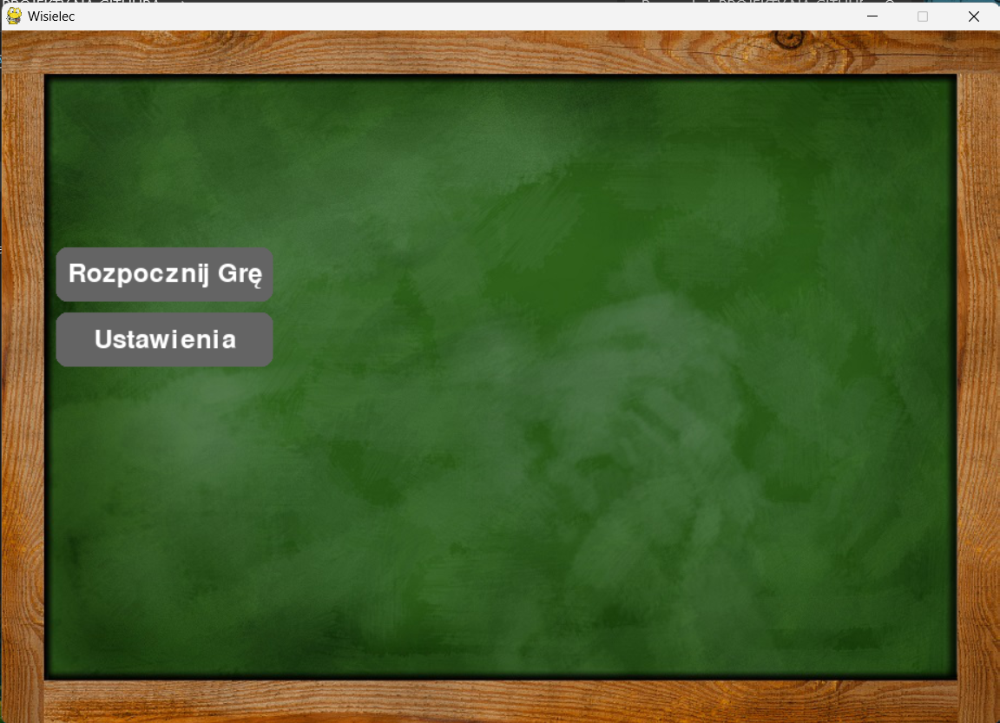

# Wisielec (Hangman) - Pygame
 [PL]
 Prosta gra w wisielca z kategoriami i punktami.
 Projekt napisany na potrzeby studiów PANS w Ciechanowie. (Rok II, Semestr Zimowy)
 
 Do uruchomienia wymagany jest :
 - Python (3.11)
 - PyGame
 
 ### Licencja:
 Dostępna w pliku License.txt w repozytorium.
 Należy zapoznać się z treścią.

 [ENG]
 Simple hangman game with categories and points.
 This project was created for academic purposes at PANS in Ciechanow. (Year II, Winter Semester)

 Requirements for running the program include:
 - Python (3.11)
 - PyGame
 
 ### License:
 Available in the License.txt file in the repository.
 Please familiarize yourself with its contents.