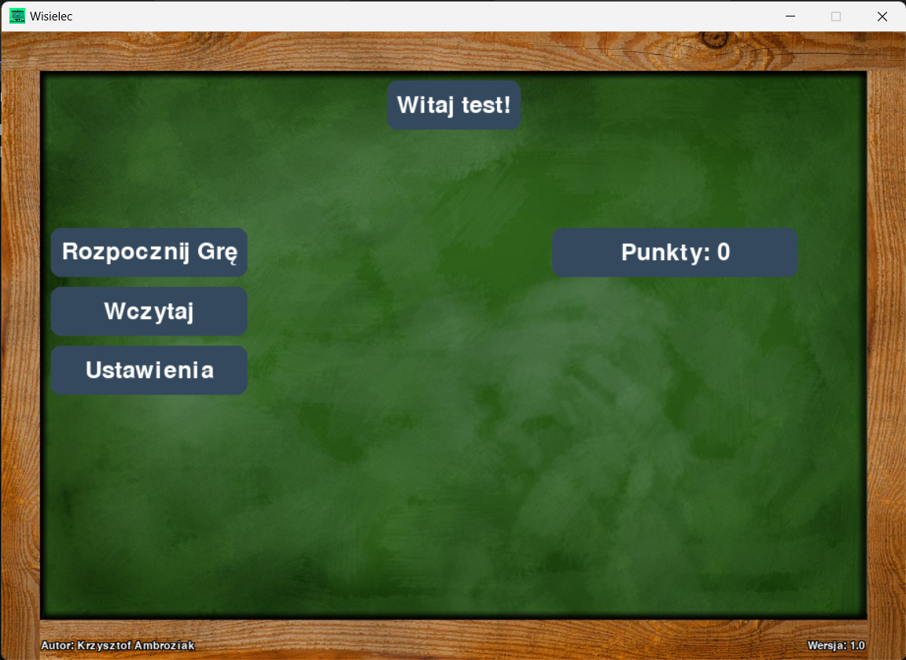

# Wisielec (Hangman) - Pygame
 [PL]
 Prosta gra w wisielca z kategoriami i punktami. 
 Projekt napisany na potrzeby studiów PANS w Ciechanowie. (Rok II, Semestr Zimowy)   
 
 Do uruchomienia wymagany jest : 
 - Python (3.11) 
 - PyGame 
 
 ### Licencja:  
 Dostępna w pliku License.txt w repozytorium.  
 Należy zapoznać się z treścią.  

 [ENG]  
 Simple hangman game with categories and points.  
 This project was created for academic purposes at PANS in Ciechanow. (Year II, Winter Semester)    

 Requirements for running the program include:  
 - Python (3.11)  
 - PyGame  
 
 ### License:
 Available in the License.txt file in the repository.  
 Please familiarize yourself with its contents.  